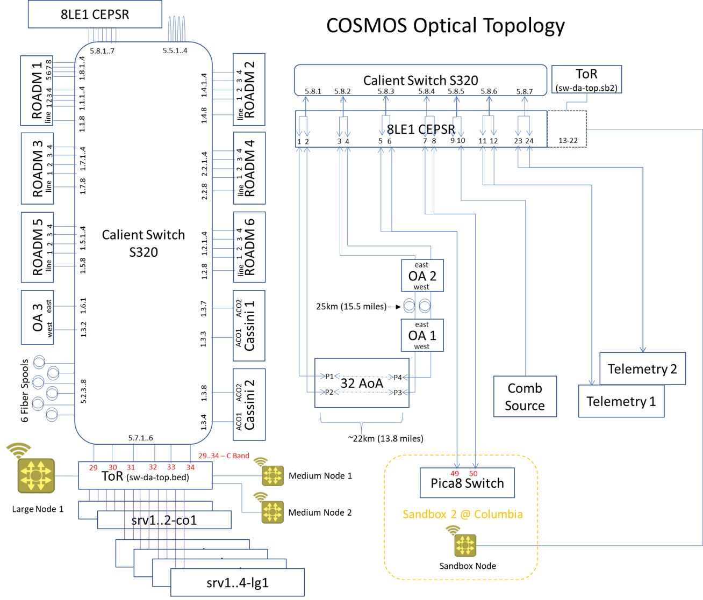
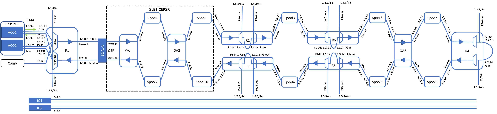

# COSMOS-Telemetry-Experiment

### 1. COSMOS Testbed

programmable optical network overview
more info: https://wiki.cosmos-lab.org/wiki/Architecture/optical#Optical

### 2. Long reach network configuration
build the experiment topology below

